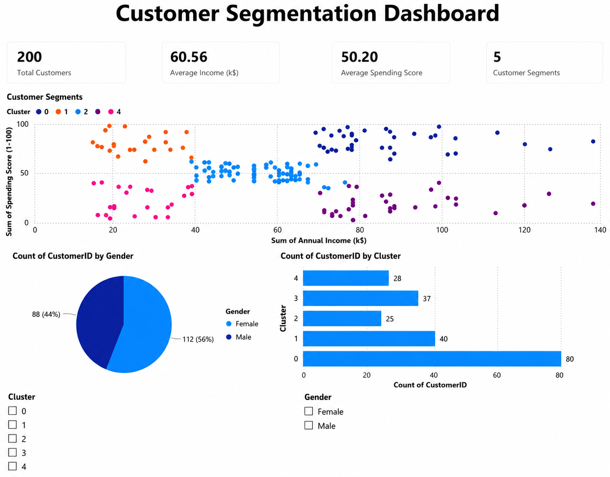

# Customer Segmentation Analysis

A machine learning project that uses the K-Means clustering algorithm to segment customers based on their annual income and spending behavior. The project also includes an interactive Power BI dashboard for visualizing customer segments and business insights.

## Project Overview

Customer segmentation helps businesses understand different types of customers and create targeted marketing strategies. In this project, customers are grouped into distinct clusters using K-Means clustering based on their Annual Income and Spending Score.

## Dataset

- **Source:** Kaggle - Mall Customer Segmentation Dataset
- **Records:** 200 customers
- **Features:**
  - CustomerID
  - Gender
  - Age
  - Annual Income (k$)
  - Spending Score (1-100)

## Technologies Used

- Python
- Pandas
- Matplotlib
- Scikit-learn
- Jupyter Notebook
- Power BI

## Project Workflow

1. Load the dataset using Pandas.
2. Check for missing values and duplicate records.
3. Select relevant features for clustering.
4. Explore customer distribution using scatter plots.
5. Apply the Elbow Method to determine the optimal number of clusters.
6. Train a K-Means clustering model.
7. Assign cluster labels to each customer.
8. Analyze cluster characteristics.
9. Create an interactive Power BI dashboard.

## Machine Learning

**Algorithm Used:** K-Means Clustering

Features used for clustering:
- Annual Income (k$)
- Spending Score (1-100)

The Elbow Method was used to determine the optimal number of clusters (K = 5).

## Cluster Interpretation

| Cluster | Description |
|----------|-------------|
| Cluster 0 | Medium Income, Medium Spending |
| Cluster 1 | High Income, High Spending |
| Cluster 2 | Low Income, High Spending |
| Cluster 3 | High Income, Low Spending |
| Cluster 4 | Low Income, Low Spending |

## Dashboard Features

- KPI Cards
  - Total Customers
  - Average Income
  - Average Spending Score
  - Number of Customer Segments

- Scatter Plot
  - Annual Income vs Spending Score
  - Colored by customer cluster

- Gender Distribution

- Customers per Cluster

- Interactive Filters
  - Cluster
  - Gender

## Business Insights

- High-income, high-spending customers are premium customers.
- High-income, low-spending customers can be targeted with personalized offers.
- Low-income, high-spending customers are frequent buyers and may respond well to discounts.
- Average customers form the largest customer base.
- Customer segmentation helps businesses improve marketing and customer retention strategies.

## Repository Structure

```
Customer-Segmentation-Analysis/
│
├── data/
│   └── Mall_Customers.csv
|   └── Mall_Customers_Clusters.csv
│
├── notebook/
│   └── mall_customer_segmentation.ipynb
│
├── dashboard/
│   └── customer_segmentation_dashboard.pbix
│
├── images/
|   └── cluster.png
│   └── dashboard.png
|   └── elbow method.png
│
└── README.md
└──  requirements.txt
```
## Dashboard Preview

## Results

- Successfully segmented customers into five groups.
- Built a machine learning model using K-Means clustering.
- Created an interactive Power BI dashboard for visualization.
- Generated business insights from customer behavior.
